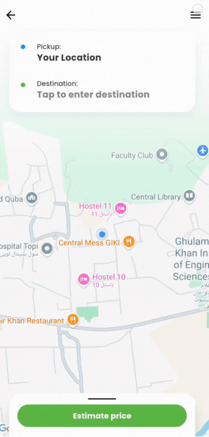

# Uber for Drivers

    <em>
        The code is proprietary and cannot be shared. To discuss, email mujtabaomar123@gmail.com
    </em>

## Idea
This is a mobile application for drivers to digitalize their work, allowing them to estimate ride fares, navigate through the shortest route, manage their rides and track earnings.

## Features
- **Ride Fare Estimation**: Drivers can input the pickup and drop-off locations to get an estimated fare for the ride, according to the rates set by them.

- **In-app Navigation**: The app provides in-app navigation to help drivers find the best routes to their destinations.

- **Earnings Tracker**: Drivers can track their earnings for any period of time. The app can also generate revenue and tax receipts for any period of time.

- **Ride History**: Drivers can view their ride history, including details like date, time, fare, and distance traveled. They can filter by time period and print receipts of any rides ever taken.

- **Profile Management**: Drivers can manage their profiles, including personal information, vehicle details, and payment methods.

- **Multi-Lingual Support**: The app can support multiple languages to cater to a diverse driver base. Designed to be used in Finland, currently it supports only Finnish and English.

## Tech Stack Used
- **Frontend**: Flutter
- **Backend**: Flask
- **Database**: Firebase
- **Hosting**: Firebase, PythonAnywhere
- **Maps**: Google Maps API
- **OTP Service**: Twilio

## User Experience
The app is designed to be user-friendly and intuitive, with a focus on providing drivers with the information they need quickly and efficiently. The interface is clean and modern, with a consistent color scheme and typography. This project taught me a lot about how to think about design from a user's perspective. Here are some examples of what I mean:

### Snappy Interface
The app is designed to be snappy and responsive, allowing drivers to navigate through the app quickly. It's not easy to do in an application that's constantly talking to the server. This is made possible by **storing** a copy of the fetched data **locally** and **syncing** data with the server **asynchronously**.

    

### Instant Language Change
The app allows drivers to **change the language instantly** without needing to restart. It currently supports Finnish and English, but can be easily extended to support additional languages in the future. Personally, I was very impressed with how this turned out. I don't think I have ever seen a faster and more convenient language change option.

    

### Intuitive History Graphs
The app provides a visual representation of the driver's earnings over time. The graphs are **interactive**, allowing drivers to tap on specific points to see detailed information about their earnings for that period. This was the most fun page to implement and I think it's pretty dope.

    

### Real-Time Sync
The app stores data on to the server in real-time to ensure that all driver information — such as ride logs, profile updates, and session states - is instantly saved and synced across sessions. Even if the app is closed, reopened, or the phone temporarily goes offline during a ride, no data is lost and the app resumes itself later without a flaw.

## Screens

### Login
- The login screen allowing drivers to quickly log in using their **phone number**. 
- The app uses **OTP verification** to ensure the security of the login process. 

    
    
    

### Navigation
- The navigation screen is designed to provide drivers with all the **information** they need to navigate to their destination. 
- The in-app navigation provides not only the **route** but also the estimated time, distance, and fare. 
- It also allows the driver to continue navigating from **another map** application if needed.

    
    
    

    
    
    

### History
- The history screen allows drivers to view their **ride history**, including details like date, time, fare, and distance traveled. 
- The app provides **interactive graphs** to visualize earnings over time, and drivers can filter their history by time period.
- The app also allows drivers to print older **receipts for any ride**, and tax receipts for any period of time.

    
    
    

### Profile
- The profile screen allows drivers to manage their **personal information**, vehicle details, and payment methods.
- Drivers can **update their rates** for different times of day and different days of the week.

    
    
    

